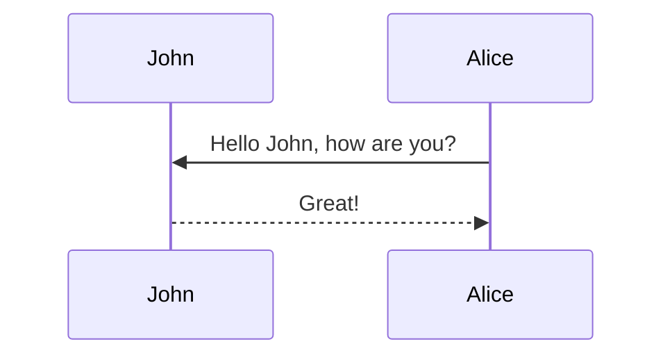
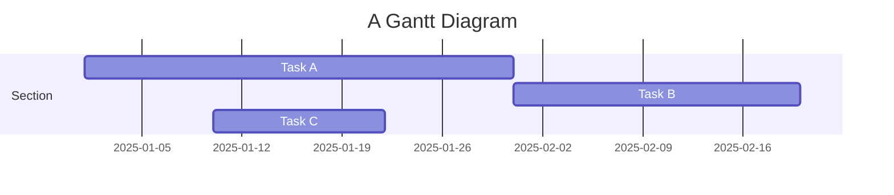

## detail box

Additional details, where math $$ 2x - 1 $$ and `code` is rendered correctly.


---

## custom blockquotes

> **TIP**
>
> A tip can be used when you want to give advice
> related to a certain content.
{: .block-tip }

> **WARNING**
>
> This is a warning, and thus should
> be used when you want to warn the user
{: .block-warning }

> **DANGER**
>
> This is a danger zone, and thus should
> be used carefully
{: .block-danger }

---

## tabs




```php
var_dump('hello');
```



```javascript
console.log("hello");
```



```javascript
pputs 'hello'
```




---

## pseudocode
```yml
pseudocode: true
```
```pseudocode
% This quicksort algorithm is extracted from Chapter 7, Introduction to Algorithms (3rd edition)
\begin{algorithm}
\caption{Quicksort}
\begin{algorithmic}
\PROCEDURE{Quicksort}{$$A, p, r$$}
    \IF{$$p < r$$}
        \STATE $$q = $$ \CALL{Partition}{$$A, p, r$$}
        \STATE \CALL{Quicksort}{$$A, p, q - 1$$}
        \STATE \CALL{Quicksort}{$$A, q + 1, r$$}
    \ENDIF
\ENDPROCEDURE
\PROCEDURE{Partition}{$$A, p, r$$}
    \STATE $$x = A[r]$$
    \STATE $$i = p - 1$$
    \FOR{$$j = p$$ \TO $$r - 1$$}
        \IF{$$A[j] < x$$}
            \STATE $$i = i + 1$$
            \STATE exchange
            $$A[i]$$ with $$A[j]$$
        \ENDIF
        \STATE exchange $$A[i]$$ with $$A[r]$$
    \ENDFOR
\ENDPROCEDURE
\end{algorithmic}
\end{algorithm}
```

---

## Image, Video, Audio

### multiple image
2~3개의 이미지를 같은 줄에 넣기 
<div class="row mt-3">
    <div class="col-sm mt-3 mt-md-0">
        
    </div>
    <div class="col-sm mt-3 mt-md-0">
        
    </div>
</div>


---

### swiper-container
이미지 여러장 옆으로 넘기면서 보기
```yml
images:
  slider: true  # 이미지 여러장 옆으로 넘기면서 보기
```
<swiper-container keyboard="true" navigation="true" pagination="true" pagination-clickable="true" pagination-dynamic-bullets="true" rewind="true">
  <swiper-slide></swiper-slide>
  <swiper-slide></swiper-slide>
  <swiper-slide></swiper-slide>
</swiper-container>

### img-comparison-slider
좌우로 슬라이더로 비교  
```yml
images:
  slider: true  # 이미지 여러장 옆으로 넘기면서 보기
```

  
  
</img-comparison-slider>

---

### video


유튜브 링크를 그대로 가져올 경우 다음과 같은 embed 링크로 변환해줘야함
```
https://youtu.be/kCc8FmEb1nY → https://www.youtube.com/embed/kCc8FmEb1nY
```


---

### audio



---

## code_diff
```yml
code_diff: true
```
* diff 사용
```diff
diff --git a/sample.js b/sample.js
index 0000001..0ddf2ba
--- a/sample.js
+++ b/sample.js
@@ -1 +1 @@
-console.log("Hello World!")
+console.log("Hello from Diff2Html!")
```

* diff2html 사용
```diff2html
diff --git a/sample.js b/sample.js
index 0000001..0ddf2ba
--- a/sample.js
+++ b/sample.js
@@ -1 +1 @@
-console.log("Hello World!")
+console.log("Hello from Diff2Html!")
```

---


## typograms
```yml
typograms: true
```
```typograms
.------------------------.
|.----------------------.|
||"https://example.com" ||
|'----------------------'|
| ______________________ |
||                      ||
||   Welcome!           ||
||                      ||
||                      ||
||  .----------------.  ||
||  | username       |  ||
||  '----------------'  ||
||  .----------------.  ||
||  |"*******"       |  ||
||  '----------------'  ||
||                      ||
||  .----------------.  ||
||  |   "Sign-up"    |  ||
||  '----------------'  ||
||                      ||
|+----------------------+|
.------------------------.
```

---

## Chart
```yml
chart:
  echarts: true
  chartjs: true
  plotly: true
  vega_lite: true
```
### echarts
```echarts
{
  "title": {
    "text": "ECharts Getting Started Example"
  },
  "responsive": true,
  "tooltip": {},
  "legend": {
    "top": "30px",
    "data": ["sales"]
  },
  "xAxis": {
    "data": ["Shirts", "Cardigans", "Chiffons", "Pants", "Heels", "Socks"]
  },
  "yAxis": {},
  "series": [
    {
      "name": "sales",
      "type": "bar",
      "data": [5, 20, 36, 10, 10, 20]
    }
  ]
}
```

### chartjs
```chartjs
{
  "type": "line",
  "data": {
    "labels": [
      "January",
      "February",
      "March",
      "April",
      "May",
      "June",
      "July"
    ],
    "datasets": [
      {
        "label": "# of bugs",
        "fill": false,
        "lineTension": 0.1,
        "backgroundColor": "rgba(75,192,192,0.4)",
        "borderColor": "rgba(75,192,192,1)",
        "borderCapStyle": "butt",
        "borderDash": [],
        "borderDashOffset": 0,
        "borderJoinStyle": "miter",
        "pointBorderColor": "rgba(75,192,192,1)",
        "pointBackgroundColor": "#fff",
        "pointBorderWidth": 1,
        "pointHoverRadius": 5,
        "pointHoverBackgroundColor": "rgba(75,192,192,1)",
        "pointHoverBorderColor": "rgba(220,220,220,1)",
        "pointHoverBorderWidth": 2,
        "pointRadius": 1,
        "pointHitRadius": 10,
        "data": [
          65,
          59,
          80,
          81,
          56,
          55,
          40
        ],
        "spanGaps": false
      }
    ]
  },
  "options": {}
}
```

### plotly

```plotly
{
  "data": [
    {
      "x": [1, 2, 3, 4],
      "y": [10, 15, 13, 17],
      "mode": "markers"
    },
    {
      "x": [2, 3, 4, 5],
      "y": [16, 5, 11, 9],
      "mode": "lines"
    },
    {
      "x": [1, 2, 3, 4],
      "y": [12, 9, 15, 12],
      "mode": "lines+markers"
    }
  ],
  "layout": {
    "title": {
      "text": "Line and Scatter Plot"
    }
  }
}
```

### vega_lite

```vega_lite
{
  "$schema": "https://vega.github.io/schema/vega-lite/v5.json",
  "description": "A dot plot showing each movie in the database, and the difference from the average movie rating. The display is sorted by year to visualize everything in sequential order. The graph is for all Movies before 2019.",
  "data": {
    "url": "https://raw.githubusercontent.com/vega/vega/main/docs/data/movies.json"
  },
  "transform": [
    {"filter": "datum['IMDB Rating'] != null"},
    {"filter": {"timeUnit": "year", "field": "Release Date", "range": [null, 2019]}},
    {
      "joinaggregate": [{
        "op": "mean",
        "field": "IMDB Rating",
        "as": "AverageRating"
      }]
    },
    {
      "calculate": "datum['IMDB Rating'] - datum.AverageRating",
      "as": "RatingDelta"
    }
  ],
  "mark": "point",
  "encoding": {
    "x": {
      "field": "Release Date",
      "type": "temporal"
    },
    "y": {
      "field": "RatingDelta",
      "type": "quantitative",
      "title": "Rating Delta"
    },
    "color": {
      "field": "RatingDelta",
      "type": "quantitative",
      "scale": {"domainMid": 0},
      "title": "Rating Delta"
    }
  }
}
```

---

## mermaid (diagrams)
```yml
mermaid:
  enabled: true
  zoomable: true
```



---

## detail codeblock

lineos를 통해 줄번호 입력 가능하지만, `pretty_table: true` 해주면 선이 보여서 별로임



int main(int argc, char const \*argv[])
{
string myString;

    cout << "input a string: ";
    getline(cin, myString);
    int length = myString.length();

    char charArray = new char * [length];

    charArray = myString;
    for(int i = 0; i < length; ++i){
        cout << charArray[i] << " ";
    }

    return 0;

}



---

## toc
목차를 어떻게 쓸건지임
```yml
toc:
  beginning: true  # 맨 앞에 목차
  sidebar: left  # 목차가 사이드바 왼쪽에 붙어있음
```

---

## jupyter notebook

{::nomarkdown}



  

  <p>Sorry, the notebook you are looking for does not exist.</p>

{:/nomarkdown}

---

## pretty_table
이걸 해야 표에 선이 생김
```yml
pretty_table: true
```

| Left aligned | Center aligned | Right aligned |
| :----------- | :------------: | ------------: |
| Left 1       |    center 1    |       right 1 |
| Left 2       |    center 2    |       right 2 |
| Left 3       |    center 3    |       right 3 |

<table
  data-click-to-select="true"
  data-height="460"
  data-pagination="true"
  data-search="true"
  data-toggle="table"
  data-url="{{ '/assets/json/table_data.json' | relative_url }}">
  <thead>
    <tr>
      <th data-checkbox="true"></th>
      <th data-field="id" data-halign="left" data-align="center" data-sortable="true">ID</th>
      <th data-field="name" data-halign="center" data-align="right" data-sortable="true">Item Name</th>
      <th data-field="price" data-halign="right" data-align="left" data-sortable="true">Item Price</th>
    </tr>
  </thead>
</table>

---

## Redirect
이런 식으로 쓰면 글 눌렀을 때 바로 그 경로로 가짐
```yml
redirect: /assets/pdf/example_pdf.pdf
```

## Citation
```yml
citation: true
```
이 아래 내용은 내가 안쓴건데 "이 사이트가 유용했다면 다음과 같은 방법으로 인용해주세요~" 라고 해줌  
👇👇👇